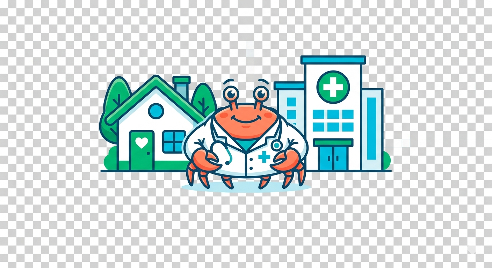
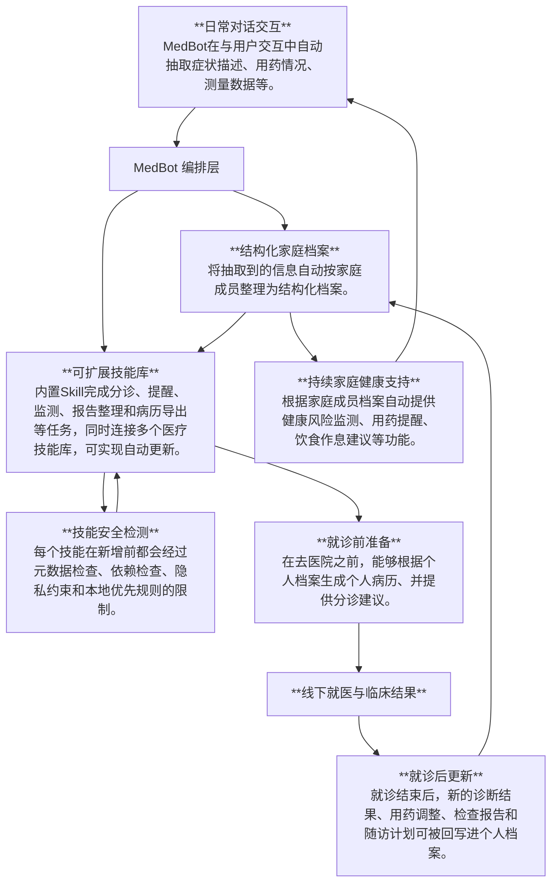

<div align="center">
  
  <h1>MedBot：面向个人与家庭的健康 AI 助手</h1>
  <p>
    <a href="./README.md">English</a> | <a href="./README-zh.md">中文</a>
  </p>
  <p>
    
    
  </p>
</div>

**MedBot** 是基于 [nanobot](https://github.com/HKUDS/nanobot) 构建的个人与家庭健康助手。

它的核心定位，不是替代医生，也不是医院内部系统，而是去解决 **家庭日常健康管理** 和 **真正进入医院就诊流程** 之间的最后一公里。

很多时候，用户知道自己或家人“不太对劲”，但并不清楚：

- 该先记录什么
- 需不需要尽快去医院
- 去医院前该整理哪些症状、用药和检查信息
- 如何把分散的健康信息说清楚

MedBot 主要服务的，就是这一段“从在家发现问题，到准备就医”的中间过程。它帮助个人和家庭在自然对话交互中把信息整理好，并实时健康家庭成员的健康风险、把就医前后的管理做得更连续。

它**不替代医生诊断**，而是帮助用户在就医前准备得更充分、在就医时沟通得更清楚、在就医后继续做好家庭健康管理。

## MedBot 目前能做什么

- 整理家庭病历、症状、用药、检查报告与长期记录
- 在去医院前进行预分诊和信息收集
- 记录血压、血糖等连续健康指标并查看趋势
- 做家庭风险扫描和药物相关检查
- 基于已有档案生成饮食、作息与日常管理建议
- 安排用药提醒、复查提醒和周期性健康任务

## 项目特点

- **面向个人与家庭**：围绕家庭健康场景设计，而不是医院端工作流
- **交互中信息收集**：只需要与agent进行日常对话，就能完成信息收集
- **连接家庭与医院**：重点解决“感觉不舒服”到“准备好去就医”之间的信息断层
- **隐私优先、本地优先**：敏感健康数据默认保留在本地
- **技能驱动**：通过 `SKILL.md` 扩展医疗、健康、档案和自动化能力
- **多通道、多模型**：支持多种聊天通道和多个 LLM 提供商

## 核心架构

MedBot 本质上是一个面向个人与家庭的健康闭环系统，核心围绕 4 个设计点展开：

- **内置医疗技能**：系统默认提供预分诊、用药提醒、风险监测、报告录入、病历导出、健康指标追踪等技能
- **技能扩展与自更新**：MedBot 可以发现、加载、安装并维护新技能，使能力能随着家庭真实需求持续演进
- **技能安全检测**：技能不是直接执行，而是结合元数据、依赖检查、隐私规则与本地优先策略进行约束
- **结构化家庭档案**：长期健康信息以结构化家庭档案沉淀，而不是散落在聊天记录里

这让 MedBot 不只是一个聊天机器人，而是一个能持续运转的健康工作流：

- 用户日常交互不断更新家庭档案
- 档案内容触发相应的技能、提醒与监测
- 去医院前可生成个人病历摘要与就诊准备信息
- 就诊结果再写回档案
- 更新后的档案继续驱动后续风险扫描、提醒和健康管理

## 闭环系统图



## 内置技能

| 类别 | 技能 | 作用 |
|------|------|------|
| 医疗 | `medclaw-pretriage` | 院前与诊前分诊引导 |
| 医疗 | `medication-reminder` | 用药提醒与档案同步 |
| 医疗 | `risk-monitoring` | 每日家庭健康风险扫描 |
| 医疗 | `drug-interaction-check` | 药物相互作用检查 |
| 医疗 | `medical-record-export` | 病历导出 |
| 医疗 | `medical-report-ingest` | 医疗报告录入与摘要 |
| 健康 | `diet-routine-guidance` | 饮食、睡眠与作息建议 |
| 健康 | `health-metrics` | 连续健康指标与趋势图 |
| 档案 | `memory` | 长期记忆与结构化家庭医疗档案 |
| 档案 | `family-medical-record` | 家庭成员结构化病历 |
| 工具 | `cron` | 定时任务与提醒 |
| 工具 | `skill-finder` / `clawhub` | 技能发现与安装 |
| 其他 | `weather`, `github`, `tmux`, `summarize` | 辅助类技能 |

每个技能的行为范围见对应目录下的 `SKILL.md`。隐私与最小化数据原则见 `medbot/templates/AGENTS.md`。


## 对话示例

```text
You: 你好，我是sirry，你叫什么

🦀 medbot
你好，sirry！我是MedBot，你的健康助手。有什么我可以帮助你的吗？

You: 我早上醒来发现我鼻子堵住了，头有点晕，吃了一点玄麦甘桔颗粒

🦀 medbot
我已经记录了你今天早上出现的症状，包括鼻子堵住和头晕，以及你服用的玄麦甘桔颗粒。
如果你有其他症状或需要进一步的建议，请告诉我！

You: 我父亲昨天感冒的，他发烧到39度，早上才压下来，可能是他传染我的

🦀 medbot
我已经记录了你父亲昨天发烧到39度的症状。看起来你们可能是相互传染的。如果你有其他
症状或需要进一步的建议，请随时告诉我！希望你们都能尽快好起来。

You: 我父亲有高血压，在吃卡托普利，现在能吃布诺芬吗

🦀 medbot
你父亲正在服用的卡托普利与布诺芬之间存在中等程度的相互作用。布诺芬可能会减弱卡托
普利的降压效果，并可能导致液体潴留，从而影响血压。此外，长期使用布诺芬可能会对肾
功能产生不利影响。

如果他需要使用布诺芬，建议在使用期间密切监测血压和肾功能，尤其是在长期使用的情况
下。最好在医生的指导下进行。

如果你有其他问题或需要进一步的帮助，请告诉我！

You: 我想带我父亲去医院看看，你帮我导出他的病历吧

🦀 medbot
我已经成功导出了你父亲的病历。你可以在以下路径找到他的病历文件：                
.medbot/workspace/family/father/doctor_export_20260318.md          

```

## 本地部署并快速开始

```bash
git clone https://github.com/openclaw/MedBot.git
cd MedBot
pip install -e .
medbot onboard
medbot agent
```

编辑 `~/.medbot/config.json`，至少配置：

- `providers`：填写 API Key
- `agents.defaults.model`：指定模型
- `channels`：如需 Telegram、飞书、QQ、邮件等接入时再启用

需要多通道接入时启动网关：

```bash
medbot gateway
```


## 配置与路径

- 配置文件：`~/.medbot/config.json`
- 工作区：默认 `~/.medbot/workspace`
- 环境变量前缀：`MEDBOT_`

如果要运行多个隔离实例，可通过 `--config` 指定不同配置文件。

## 常用 CLI 命令

| 命令 | 说明 |
|------|------|
| `medbot onboard` | 初始化配置和工作区 |
| `medbot agent` | 启动本地对话 |
| `medbot gateway` | 启动多通道网关 |
| `medbot status` | 查看当前状态 |
| `medbot channels login` | 连接 WhatsApp 等支持的通道 |

## Docker

```bash
docker build -t medbot .
docker run -v ~/.medbot:/root/.medbot --rm medbot onboard
docker run -v ~/.medbot:/root/.medbot -p 18790:18790 medbot gateway
```

也可以直接使用仓库内的 `docker-compose.yml`。

## 项目结构

```text
medbot/
├── agent/       # 主循环、上下文、记忆、技能、工具
├── skills/      # 内置医疗与辅助技能
├── channels/    # 聊天通道接入
├── providers/   # LLM 提供商
├── config/      # 配置与路径
├── cron/        # 定时任务
├── heartbeat/   # 周期任务
└── cli/         # 命令行
```

## 文档

- [CONTRIBUTING.md](./CONTRIBUTING.md)
- [SECURITY.md](./SECURITY.md)
- [docs/CHANNEL_PLUGIN_GUIDE.md](./docs/CHANNEL_PLUGIN_GUIDE.md)

## TODO

- 语音交互，计划使用 `Deepgram`
- 自动说话人识别，计划使用 `WeSpeaker`
- 根据病情、症状、预诊情况，推荐就诊医院

MedBot 主要用于教育、研究与技术交流。它是健康辅助工具，不替代专业诊断与治疗。
