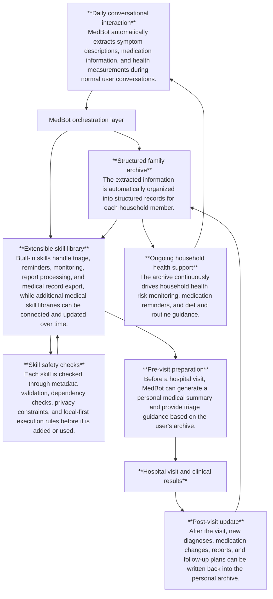

<div align="center">
  
  <h1>MedBot: Health AI Assistant for Individuals and Families</h1>
  <p>
    <a href="./README.md">English</a> | <a href="./README-zh.md">中文</a>
  </p>
  <p>
    
    
  </p>
</div>

**MedBot** is a personal and family health assistant built on top of [nanobot](https://github.com/HKUDS/nanobot).

Its core role is not to replace doctors, nor to serve as an internal hospital system, but to solve the **last mile** between everyday health management at home and actual entry into the hospital care process.

Many users know that something feels wrong for themselves or their family members, but still do not know:

- what should be recorded first
- whether they should go to the hospital soon
- what symptoms, medications, and test information should be organized before a visit
- how to clearly explain scattered health information

MedBot is designed for exactly that middle stage, from noticing a problem at home to preparing for medical care. It helps individuals and families organize information through natural conversation, continuously track household health risks, and make pre-visit and post-visit management more connected.

It does **not** replace medical diagnosis. Instead, it helps users prepare better before a visit, communicate more clearly during care, and continue family health management afterward.

## What MedBot Can Do Today

- Organizing family medical records, symptoms, medications, and reports
- Guiding pre-visit triage before a hospital visit
- Tracking blood pressure, glucose, and other time-series health metrics
- Running household risk scans and medication-related checks
- Generating diet and daily routine guidance based on existing records
- Scheduling reminders for medication, follow-up, and recurring health tasks

## Key Characteristics

- **For individuals and families**: built around household use, not hospital-side workflow systems
- **Collects information during conversation**: everyday conversation with the agent can naturally become structured health information capture
- **Bridges the care gap**: supports the stage from "I feel unwell" to "I am ready to seek care"
- **Privacy-first and local-first**: sensitive health data stays local by default
- **Skill-driven**: medical, health, record, and automation skills can be extended with custom `SKILL.md`
- **Multi-channel and multi-model**: supports chat channels and multiple LLM providers

## Core Architecture

MedBot is designed as a closed-loop personal and family health system built around four core ideas:

- **Built-in medical skills**: the system starts with ready-to-use skills for pre-visit triage, reminders, risk monitoring, report ingestion, record export, and health metric tracking
- **Skill extension and self-update**: MedBot can discover, load, install, and maintain new skills so capabilities can evolve with real household needs
- **Skill safety checks**: skills are not only loaded, but also filtered through metadata, requirement checks, and privacy-oriented execution rules
- **Structured family archive**: all long-term household health information is organized as structured family records instead of scattered chat messages

This makes MedBot more than a chatbot. It becomes a looped health workflow:

- daily interaction updates the family archive
- archive data activates relevant skills and reminders
- skills help prepare before a hospital visit
- hospital outcomes are written back into the archive
- the updated archive drives future monitoring and support

## Closed-Loop System



## Built-in Skills

| Category | Skill | Purpose |
|------|------|------|
| Medical | `medclaw-pretriage` | Pre-hospital and pre-visit triage guidance |
| Medical | `medication-reminder` | Medication reminders with record sync |
| Medical | `risk-monitoring` | Daily household health risk scan |
| Medical | `drug-interaction-check` | Medication interaction checks |
| Medical | `medical-record-export` | Medical record export |
| Medical | `medical-report-ingest` | Medical report ingestion and summarization |
| Health | `diet-routine-guidance` | Diet, sleep, and routine guidance |
| Health | `health-metrics` | Time-series health metrics and trend charts |
| Records | `memory` | Long-term memory plus structured family archive |
| Records | `family-medical-record` | Structured records for household members |
| Tools | `cron` | Scheduled tasks and reminders |
| Tools | `skill-finder` / `clawhub` | Skill discovery and installation |
| Other | `weather`, `github`, `tmux`, `summarize` | Supporting utility skills |

See each skill folder's `SKILL.md` for behavior and scope. Privacy and data minimization rules are defined in `medbot/templates/AGENTS.md`.

## Example Conversation

```text
You: Hi, I'm sirry. What's your name?

🦀 medbot
Hello, sirry! I'm MedBot, your health assistant. What can I help you with?

You: When I woke up this morning, I found that my nose was blocked and I felt a little dizzy. I took some Xuanmai Ganjie Granules.

🦀 medbot
I have recorded the symptoms you had this morning, including a blocked nose and dizziness, as well as the Xuanmai Ganjie Granules you took.
If you have any other symptoms or need further advice, please let me know!

You: My father caught a cold yesterday. His fever went up to 39 C and only came down this morning. He may have infected me.

🦀 medbot
I have recorded that your father had a fever of 39 C yesterday. It looks like you may have infected each other. If you have any other
symptoms or need further advice, please let me know anytime. I hope both of you feel better soon.

You: My father has hypertension and is taking captopril. Can he take ibuprofen now?

🦀 medbot
There is a moderate interaction between the captopril your father is taking and ibuprofen. Ibuprofen may reduce the blood-pressure-
lowering effect of captopril and may also cause fluid retention, which can affect blood pressure. In addition, long-term use of ibuprofen
may have adverse effects on kidney function.

If he needs to use ibuprofen, it is recommended to closely monitor his blood pressure and kidney function during use, especially if it
is used for a longer period. It is best to do this under a doctor's guidance.

If you have any other questions or need further help, please let me know!

You: I want to take my father to the hospital. Please help me export his medical record.

🦀 medbot
I have successfully exported your father's medical record. You can find the file at the following path:
.medbot/workspace/family/father/doctor_export_20260318.md          

```

## Local Deployment and Quick Start

```bash
git clone https://github.com/openclaw/MedBot.git
cd MedBot
pip install -e .
medbot onboard
medbot agent
```

Edit `~/.medbot/config.json` to at least configure:

- `providers` for your API keys
- `agents.defaults.model` for the model you want to use
- `channels` if you want Telegram, Feishu, QQ, Email, or other integrations

Start the gateway when you want channel integrations:

```bash
medbot gateway
```


## Config and Paths

- Config file: `~/.medbot/config.json`
- Workspace: `~/.medbot/workspace` by default
- Environment variable prefix: `MEDBOT_`

Use `--config` when running multiple isolated instances.

## Common CLI Commands

| Command | Description |
|------|------|
| `medbot onboard` | Initialize config and workspace |
| `medbot agent` | Start local chat |
| `medbot gateway` | Start the multi-channel gateway |
| `medbot status` | Show current status |
| `medbot channels login` | Link supported channels such as WhatsApp |

## Docker

```bash
docker build -t medbot .
docker run -v ~/.medbot:/root/.medbot --rm medbot onboard
docker run -v ~/.medbot:/root/.medbot -p 18790:18790 medbot gateway
```

You can also use the included `docker-compose.yml`.

## Project Structure

```text
medbot/
├── agent/       # loop, context, memory, skills, tools
├── skills/      # built-in medical and utility skills
├── channels/    # chat integrations
├── providers/   # LLM providers
├── config/      # config and path helpers
├── cron/        # scheduled tasks
├── heartbeat/   # recurring tasks
└── cli/         # CLI commands
```

## Documentation

- [CONTRIBUTING.md](./CONTRIBUTING.md)
- [SECURITY.md](./SECURITY.md)
- [docs/CHANNEL_PLUGIN_GUIDE.md](./docs/CHANNEL_PLUGIN_GUIDE.md)

## TODO

- Voice interaction support, planned with `Deepgram`
- Automatic speaker identification, planned with `WeSpeaker`
- Recommend suitable hospitals for treatment based on the patient’s condition, symptoms, and preliminary diagnosis.

MedBot is intended for education, research, and technical exchange. It is a health support assistant, not a replacement for professional diagnosis or treatment.
